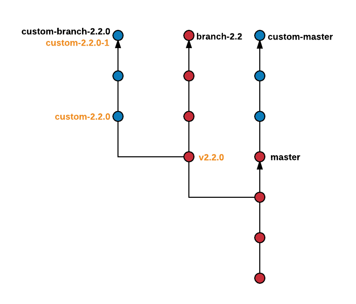

**WARNING:** not all these instructions have been tested, especially
the specific git commands, and they shouldn't be followed mindlessly.
They are meant to give an idea of how each process is carried out.
You should first understand what the hell you're doing.


# Setup repo
```
# Public fork of Apache Spark.  Used for public pull requests.
git remote add origin git@github.com:mesosphere/spark.git
git fetch origin

# Apache Spark
git remote add upstream git@github.com:apache/spark
git fetch upstream
```

# Pull Request

```
git checkout master
git pull upstream master
git checkout -b <feature-branch> upstream/master
# write feature
git push origin <feature-branch>
# create PR against apache/spark
```

# Backport

```
# Let's say we want to backport <commit> to custom
git checkout custom-branch-2.0.1
git cherry-pick <commit>
git push origin custom-branch-2.0.1

# Optionally, if this is a critical bugfix that must go out immediately, we can do a release of 2.0.1-1
```

# Release

A release of a DC/OS Spark package is two steps:

1. Release a Spark distribution
2. Release a DC/OS Spark package

## Release a Spark distribution

We cut a DC/OS Spark release in two scenarios:

1. Apache Spark cuts a release.
2. We need to make a bugfix release.

Follow the instructions for creating a tag depending on which release
you're doing:

### Apache Spark tag (Major version)

```
# Wait for apache/spark to tag a release (follow the developers' email
# list).  Let 2.1.0 be the release version.
# fetch remotes:
git fetch upstream --tags

# rebase custom-master:
git checkout custom-master
git rebase master
git push -f origin

# create release branch:
git checkout -b custom-branch-2.1.0 v2.1.0

# cherry-pick custom commits:
git cherry-pick upstream/master..origin/custom-master
git tag -a custom-2.1.0
git push origin custom-2.1.0
git push origin
```

Then run the [release build][1]

### Apache Spark tag (Minor version)

```
# Wait for apache/spark to tag a release (follow the developers' email
# list).  Let 2.0.1 be the release version.
git fetch upstream --tags
git checkout -b custom-branch-2.0.1 custom-branch-2.0.0
git push origin custom-branch-2.0.1
git rebase v2.0.1
git tag -a custom-2.0.1
git push origin custom-2.0.1
```

Then run the [release build][1]

After releasing a Spark distribution, add all builds to this page: https://github.com/mesosphere/spark-build/blob/master/docs/spark-versions.md

## Release a DC/OS Spark package

These instructions are for the `spark-build` repo (this repo).

```
# In this example, we'll use the tag 1.0.6-2.1.0
git checkout master
# Update manifest.json with the latest Spark distributions
git commit -a -m "Updated spark-uri to version <dist-version>"
git tag -a 1.0.6-2.1.0

# push:
git push origin --tags
```

- Run the [release build][2]
- Write release notes in Github

# Branches



## upstream
- `upstream/master` # upstream master
- `upstream/branch-<version>` # upstream version branch

## origin
- `origin/master`
- `origin/custom-master` # Custom master
- `origin/custom-branch-<version>` # Branch for custom version
- `origin/custom-<version>` # Tag for custom version


[1]: https://jenkins.mesosphere.com/service/jenkins/view/Infinity/job/spark/job/spark/job/spark-release/
[2]: https://jenkins.mesosphere.com/service/jenkins/view/Infinity/job/spark/job/spark-build/job/spark-build-release/
